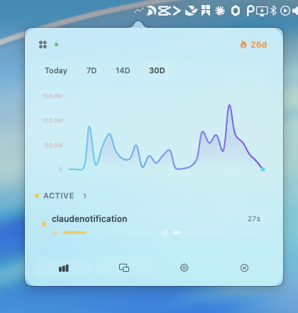

# Claude Glance

[English](README.md) | [简体中文](README.zh-CN.md)

A native macOS menu bar app for viewing local Claude Code activity, active sessions, and lightweight usage stats.

<p align="center">
  
  
  
  
</p>

<p align="center"><sub>Animated mascots. Local-first.</sub></p>


[Watch MP4 demo](docs/screenshots/claude-glance-demo.mp4)

Claude Glance passively reads local transcript data under `~/.claude/projects/` and surfaces recent activity, active sessions, and lightweight stats.

## Highlights

- Animated mascots and floating panel
- Minimal single-panel settings
- Menu bar quick glance
- Active session view
- Local transcript scanning
- Local-first by default, with no hook installation required
- CSV / JSON export

## UI Preview

Quick glance at today's stats, active sessions, and recent completions from the menu bar.



## Installation

### From Release

1. Download the latest `.dmg` or `ClaudeGlance.zip`
2. Open the DMG or unzip `ClaudeGlance.app`
3. Move it to `/Applications`
4. If macOS blocks launch, use `Open Anyway` in `Privacy & Security`

Notes:

- The current public build is unsigned and not notarized.
- On first launch, macOS may block the app until you manually allow it in `Privacy & Security`.
- GitHub Releases may include both `ClaudeGlance.zip` and a DMG build. If both are available, the DMG is the easier entry point.

### From Source

Requirements:

- Xcode 16+
- macOS 14 SDK
- Optional: `xcodegen`

```bash
git clone git@github.com:caigee-cmd/claude-glance.git
cd claude-glance
xcodebuild build -project ClaudeDash.xcodeproj -scheme ClaudeDash -destination "platform=macOS"
```

If you changed `project.yml`:

```bash
xcodegen generate
```

## Privacy

Claude Glance runs locally by default.

| Item | Behavior |
| --- | --- |
| Read | `~/.claude/projects/` transcript / session data |
| Write | `~/Library/Application Support/ClaudeDash/` |
| Network | Not required |
| Account | No login required |
| Telemetry | No cloud upload |
| Claude config changes | Does not modify `~/.claude/settings.json` |

The current public build is passive-only and keeps using `~/Library/Application Support/ClaudeDash/` for compatibility with earlier builds.

## Limitations

- macOS 14+
- Unsigned developer-oriented build
- Not notarized
- No auto-update yet
- Passive local read-only workflow

## Development

```bash
cd claude-glance
xcodebuild build -project ClaudeDash.xcodeproj -scheme ClaudeDash -destination "platform=macOS"
xcodebuild test -project ClaudeDash.xcodeproj -scheme ClaudeDash -destination "platform=macOS"
./scripts/build-release.sh
./scripts/build-dmg.sh
```

More details:

- [Release guide](docs/releasing.md)
- [Open source release checklist](docs/open-source-release-checklist.md)
- [Contributing](CONTRIBUTING.md)
- [Security](SECURITY.md)
- [Support](SUPPORT.md)

## License

[MIT](LICENSE)
